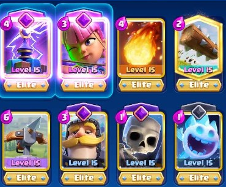

# 🤩 Hướng dẫn cho người mới chơi

## I. Khái niệm, thuật ngữ

### 1. Deck là gì?

Deck là bộ thẻ do mình sắp xếp các troops (quân lính), building (công trình), spell (thần chú) để đấu với người chơi khác trong mọi chế độ chơi.

Trong game có 2 loại Deck đó là

* Deck thông dụng (Deck có 8 card(thẻ))
* Mega Deck (Deck có 15 card)

Ở đây mình sẽ chỉ nói chủ yếu về Deck thông dụng còn Mega Deck chỉ là để chơi event (sự kiện) hoặc friendly battle (đấu giao hữu) và nó không có quy luật cycle. Bạn có thể sắp xếp deck tùy ý theo cách chơi của bạn nhưng bắt buộc bạn phải đủ 8 card (đủ deck) trước khi nhấn vào nút battle (chiến đấu) với người khác.

### 2. Ladder là gì?

Ladder dịch là cái thang, nhưng ở trong game này nó có nghĩa là bạn đang leo lên. Vậy ở đây bạn leo lên đâu, bạn leo những gì thì đó chính là 2 loại leo: Trophy Road (Leo Cúp) và Path of Legends (Leo Rank/League). Trophy Road và Path of Legends có điểm giống nhau ở chỗ đó là khi bạn leo đến một mốc nhất định là dù có thua mình sẽ không bị tụt xuống mốc thấp hơn

1. **Trophy Road là gì?**

_**Trophy Road**_ (mình xin phép viết tắt là _**TR**_) là nơi bạn sử dụng deck + chiến thuật của mình để leo cúp. Bạn càng leo được cúp cao thì reward (Phần thưởng) bạn nhận được tương ứng sẽ càng nhiều. Hiện tại trong game mốc cao nhất đang là 9000 tương ứng với Arena (Đấu trường) 23. Lời khuyên của mình đối với các bạn mới chơi đó là bạn hãy dành hết sức leo cúp đến mốc 6500 tại vì mốc đó là mình sẽ có cơ hội nhận được tất cả các card khi mở chest (rương). Card level cao thì cố gắng leo 9000 cúp là bạn sẽ nhận được reward lớn nhất khi mở chest (ưu tiên leo cái này hơn PoL chút xíu dành cho newbie). Sau đây là các mốc card có thể nhận được khi bạn mở chest tương ứng với các Arena

*   _**Training Camp (Trại huấn luyện)**_: Đây là Arena đầu tiên và duy nhất bạn được phép đánh với deck không đủ card khi bạn mới lập 1 con acc mới toanh nhằm mục đích làm quen với game như cách thả quân, thả spell, cách công/thủ cơ bản và nó không được xếp vào 23 Arena chính như mình đã nói ở trên. Các card có thể được nhận ban đầu khi mới chơi và mở chest đó là:(Mình sẽ nói theo thứ tự từ trái sang phải, từ trên xuống dưới, những Arena sau các bạn hiểu tương tự, thêm vào đó mình sẽ viết tên card dưới dạng viết tắt luôn): Arrows (Mưa tên), Minions, Archers (Cung thủ), Knight - K9 (Kị sĩ), Princess Tower (Tháp Công Chúa), Fireball - FB (Hoả cầu), Mini Pekka - Mini PK, Musketeer - Mus - Musk (Ngự lâm quân), Giant (Khổng nhân)

    <figure><figcaption></figcaption></figure>
*   _**Arena 1 - Goblin Stadium (Đấu trường Yêu tinh)**_ - Yêu cầu cúp cao hơn hoặc = 0: Các card có thể nhận được thêm cùng Arena dưới đó là: Spear Goblin - Spear Gob (Yêu tinh ném lao), Goblin - Gob (Yêu tinh), Goblin Cage - Gob Cage (Lồng yêu tinh), Goblin Hut - Gob Hut (Lều yêu tinh)

    <figure><figcaption></figcaption></figure>
* _**Arena 11 - Electro Valley (Thung lũng Điện)**_: Yêu cầu cúp cao hơn hoặc = 3400: Các card có thể nhận được thêm cùng Arena dưới đó là: The log - Log (Khúc gỗ), Mega Knight - MK (Siêu Kị sĩ), Ram Rider (Lính phá thành), Electro Wizard - Ewiz (Điện Pháp sư), Inferno Dragon - Rồng ngu (Hoả ngục long), Sparky - Xe rác, Miner (Thợ mỏ), Princess (Công chúa), Dagger Duchess - Tháp Dao (Nữ công tước ném dao)

Từ Arena 11 trở đi các bạn sẽ có thể mở chest ra được legendary card.

<figure><figcaption></figcaption></figure>

* _**Arena 16 - Executioner's Kitchen (Nhà bếp của Đao phủ)**_: Yêu cầu cúp cao hơn hoặc = 5500: Các card có thể nhận được thêm cùng Arena dưới đó là: Golden Knight - GK (Hiệp sĩ Giáp vàng), Skeleton King - Ske King (Bạch Cốt Vương)

Từ 5k5 tropy (Arena 15 trở lên) anh em có thể mở ra Champion card

<figure><figcaption></figcaption></figure>

*   _**Arena 17 - Royal Crypt (Hầm mộ Hoàng gia)**_: Yêu cầu cúp cao hơn hoặc = 6000: Các card có thể nhận được thêm cùng Arena dưới đó là: Archer Queen - AQ (Nữ hoàng Cung thủ), Mighty Miner - MM (Thợ mỏ dũng mãnh)

    <figure><figcaption></figcaption></figure>
*   _**Arena 18 - Silent Sanctuary (Ngôi đền Yên tĩnh)**_: Yêu cầu cúp cao hơn hoặc = 6500: Các card có thể nhận được thêm cùng Arena dưới đó là: Little Prince - LP (Hoàng tử bé), Monk (Thầy tu)

    <figure><figcaption></figcaption></figure>

**LƯU Ý:** Từ Arena 18 trở đi, các bạn mở mọi loại chest là các bạn đều có khả năng nhận được tất cả các card từ đầu game đến hiện tại

*   _**Arena 23 - Legendary Arena (Đấu trường Huyền thoại)**_: Yêu cầu cúp = 9000:

    <figure><figcaption></figcaption></figure>

### 3. Path of Legends là gì?

_**Path of Legends**_ _**(PoL)**_ như mình đã nói ở trên, đây cũng là 1 loại ladder khác trong game. Điểm giống và khác của PoL với TR là gì thì cùng mình tìm hiểu xem khi mà có đến 24 Arena nhưng lại chỉ có 10 League theo thứ tự Challenger I -> Challenger II -> Challenger III -> Master I -> Master II -> Master III -> Champion -> Grand Champion -> Royal Champion (RC)-> Ultimate Champion (UC).

* Điểm giống nhau:
  * Bạn cũng phải sắp xếp 1 deck gồm 8 card trước khi battle với người chơi khác để leo rank (league)
  * Khi bạn leo đến một mốc nhất định nào đó, cho dù bạn có thua thì bạn cũng không bị tụt xuống mốc thấp hơn
  * Bạn battle win đối thủ, bạn cũng nhận được chest như bạn battle trong phần TR, cứ win là auto nhận được chest nếu bạn còn thừa Chest Slot (Ô để chest - cái này mình sẽ có một mục riêng để nói kĩ hơn chút)
* Điểm khác nhau (Ở đây mình sẽ phân tích bằng hình ảnh cho các bạn) :
  * Điểm khác cơ bản đầu tiên của PoL đó là bạn sẽ leo rank của bạn thay vì leo cúp như TR tức là bạn sẽ leo từng bậc một để cải thiện rank của mình (như các bạn thấy trong hình)
  *   Mình có đánh số từ 1 đến 7 và sẽ giải thích cho các bạn ý nghĩa của từng con số:

      * **1: Card Cap Level** **(Giới hạn tối đa level (lv):** của card tương ứng với từng Rank): Cái cap level này rất quan trọng tại vì nó chỉ cho phép mình được sử dụng card level thấp hơn hoặc bằng level cap đó đối với league . VD: Mình đang chơi acc có deck như sau: Archer lv14, Ske lv13, Mortar lv15, K9 lv13, Log lv13, Rocket lv10, Bomb Tower lv10, E spirit lv12. Vậy cái lv cap ở đây có ý nghĩa rằng: TẤT CẢ card có lv lớn hơn 12 sẽ tự động về hết thành lv11 vì vượt quá cap, còn Rocket, Bomb Tower lv10 vẫn sẽ là lv10 vì chưa vượt qua lv cap. Bởi vậy theo quan điểm của mình rằng leo Rank nó sẽ công bằng hơn leo TR vì leo TR bạn có thể mang card với lv tùy ý để chơi, không bị giới hạn lv, thậm chí "Lấy thịt đè người" (Dùng card lv cao hơn để lấy lợi thế trước đối thủ); còn leo Rank nó sẽ phân loại tốt hơn người chơi hay với chưa hay do công bằng lv card.
      * **2: Time Remaining For Season (Thời gian còn lại của mỗi mùa):** Các bạn cũng cần lưu ý vấn đề này do mỗi mùa nó có thời gian nhất định. Hết số thời gian này là toàn bộ progress (quá trình) của các bạn leo Rank sẽ được làm mới sạch sẽ về League 1 khi bước sang Season mới.
      * **3 + 4: Reward per Rank's checkpoint (Phần thưởng cho mỗi mốc Rank):** Bạn leo được cao hơn hoặc bằng với các mốc tương ứng, bạn sẽ nhận được reward ONE TIME ONLY EACH SEASON (Mỗi mùa chỉ được nhận quà theo các mốc đúng 1 lần duy nhất).
      * **5: Step at each League (Bậc ở mỗi rank):** Bậc này cho biết bạn đang đứng ở Step nào trong League nào. VD trong hình là bạn đang ở bậc thứ 1 của League 1
      * **6: Golden Step (Bậc Vàng):** Khi bạn leo rank, bạn sẽ gặp 1 trong 2 trường hợp đó là Stone Step và Golden Step. Golden Step có công dụng như 1 cái checkpoint nhỏ trong League đó (Điểm lưu trữ) giúp bạn giữ ở Step đó mà không bị tụt Step khi bị thua. Lưu ý rằng Golden Step chỉ xuất hiện từ League 6 trở xuống còn từ League 7 trở đi bạn cần cố gắng rất nhiều để cải thiện skill của mình, phải win 1 loạt trận liên tiếp thì mới leo lên League tiếp theo được vì sẽ chỉ có Stone Step trong quá trình leo, còn Golden Step ở đầu mỗi League nó là cố định rank bạn không bị tụt xuống dưới thấp hơn khi thua.
      *   **7: Win Multiplayer (Cấp số nhân cho mỗi lần win đầu tiên trong Season):** Bạn có thể thắc mắc tại sao người này có ghi x7, x8, x9 thậm chí x10 dưới dòng Win Multiplayer mà mình chỉ được có x3, x4. Cái Win Multi này nó được tính dựa trên mức League cao nhất bạn leo được trong mùa ngay trước đó.

          _VD_: Season trước bạn kết thúc ở League 7 (Champion) thì ngay khi cập nhật Season mới, bạn sẽ quay trở về League 1 như hình và Win Multi sẽ là 7x.

          Công dụng của Win Multi: bạn sẽ được tính số step nhảy được khi bạn win lần đầu tiên ở Season mới, ở VD trên khi bạn win lần đầu bạn sẽ nhảy được 7 step thay vì phải leo từng Step như mới chơi hoặc bỏ dở không leo League nào ở Season trước.

          _**Lưu ý quan trọng với Win Multi:**_ Cứ mỗi lần win đầu tiên của Season mới, Multi sẽ giảm đi 1 lần cho đến khi nào còn x1 là bạn sẽ phải tiếp tục leo từng Step để tiến tới League cao hơn, nếu xen kẽ đó bạn bị thua 1 trận thì bạn sẽ ko bị trừ Multi nếu Multi còn đang lớn hơn hoặc = x2 -> Lời khuyên dành cho bạn: Hãy thử sức mình leo rank lên cao hết sức có thể để tránh trường hợp leo từng Step khi Season mới đến sẽ mất rất nhiều thời gian.

      <figure><figcaption></figcaption></figure>

### 4. Khái niệm các loại deck và thuật ngữ trong game

1. **Các thuật ngữ trong game:**

* _**Elixir (Tiên dược):**_ Elixir (Eli) là 1 trong những yếu tố quan trọng bậc nhất của trò chơi bởi lẽ Elixir quyết định rất nhiều thứ và sẽ là nhân tố ảnh hưởng trực tiếp tới chiến thuật cũng như những trận đánh của bạn. Sơ qua về Elixir thì ta có hiểu nôm na đó là 1 loại năng lượng được sản xuất ra trong mỗi trận chiến của Clash Royale. Khi vào trận đấu, mỗi 2.8 giây, hệ thống sẽ sản sinh thêm 1 điểm Elixir cho phép người chơi sử dụng để triệu tập các thẻ bài hoặc các phép thuật trong trò chơi. Mỗi phe sẽ có thể sở hữu tối đa 10 điểm Elixir và hệ thống sẽ không ngừng sản sinh ra nó trừ phi đạt đến 10. Ngoài ra, ở Arena 15 người chơi sẽ có thể mở khóa được Elixir Collector giúp nhân đôi sản lượng Elixir tạo ra trong 1 phút cuối trận đấu. Giai đoạn 60 giây cuối khi x2 eli trở đi là lúc bắt đầu bạn sẽ được thả quân nhanh hơn khi tốc độ sản xuất eli của hệ thống được tăng gấp đôi. Vì vậy hãy dùng eli 1 cách có hiệu quả để có thể chiến thắng đối thủ.
* _**Counter (Hard Counter):**_ dịch ra là 1 thẻ có khả năng chống lại 1 thẻ khác với điều kiện bằng hoặc ít eli hơn. VD: Arrows là counter của Archer, Fc (Ko evo) và là hard counter của Minion Horde
* _**Push:**_ một thuật ngữ khác của từ Attack (Tấn công). Push có thể là Small Push hoặc Big Push tùy thuộc vào số eli bạn bỏ ra để tấn công đối thủ.
* _**Counter push:**_ Counter là chống lại, Push là tấn công => Counter push là cách bạn dùng các quân ít eli để thủ 1 cách khéo léo các quân nhiều eli của đối thủ rồi sau đó bạn push lại và trả nhiều dmg cho trụ của đối thủ nhiều hơn so với mình nhận phải
* _**Rush:**_ Thả quân ở cầu tấn công đối thủ hòng gây bất ngờ
* _**Switching Lanes:**_ ở đây có nghĩa là đảo cánh tấn công. Thông thường bạn sẽ tập trung đánh 1 lane và cố gắng gây nhiều dmg lên trụ đối phương nhất có thể, switch lane tức là bạn tấn công bên còn lại. Trong tùy trường hợp, đôi khi lại là một chiến thuật hay để gây dmg lên cả 2 trụ của đối phương
* _**Kiting:**_ nghĩa là thả diều hay còn gọi là đánh lạc hướng. Ở đây tức là bạn dùng 1 card của mình dụ quân của đối thủ đi xa khỏi tầm trụ của bạn để câu thời gian cho trụ của bạn tiêu diệt quân của đối thủ.
* _**Aggro (Pulling aggro, Re-aggro, Retarget):**_ có nghĩa là thu hút. VD dễ hiểu đó là chẳng hạn bạn đang có tesla đặt ở trung tâm, đối thủ có MK ngay sát cầu. Thông thường nếu ko ra thêm 1 card nữa, MK sẽ tự động nhắm đến tesla mà đánh nhưng khi bạn đặt 1 card VD như K9 xuống gần MK thì MK sẽ đánh vào K9 chứ ko đánh tesla
*   _**Cycle:**_ cycle được dịch ra có nghĩa là chu kì. Vậy cycle của 1 card tức là như thế nào? 1 deck bạn sắp xếp để đi battle có tất cả 8 card, khi bạn dùng 1 card bất kì, thông thường bạn phải dùng tiếp **4 card** nữa thì mới thấy card mình vừa dùng xuất hiện trên tay. Mình sẽ lấy ví dụ đơn giản cho bạn dễ hiểu. Đầu tiên, VD đây là deck của mình:

    <figure><figcaption></figcaption></figure>

Khi mới bắt đầu vào trận card trên tay của mình gồm có: FB, Tesla, Ice và Ske. Ở đây mình đã sử dụng Fireball đầu tiên, vậy qua 4 card mình dùng tiếp theo trên tay mình sẽ lại có FB trong hình phía bên dưới (Mình đã có chú thích). Thứ tự card mình đã sử dụng ngay sau FB lần đầu tiên đó là: Ske -> Ice -> Archer -> Log.

<figure><figcaption>
Trước khi dùng FB
</figcaption></figure>

<figure><figcaption>
Sau khi hết 1 vòng cycle, FB đã lại có trên tay để sẵn sàng sử dụng tiếp khi cần
</figcaption></figure>

**Trường hợp đặc biệt** trong deck của bạn có Champion card\
Như deck bên dưới đây, mình có Mighty Miner trong deck. Vì đặc tính không thể có 2 champion trên map vậy nên giả sử MM của mình vẫn còn sống trên map mình có thể cycle ra Hog Rider thứ 2 chỉ mất tối thiểu 4 elixir:

MM -> Hog -> **Skeleton -> Ice Spirit -> Log** -> 2nd Hog

<figure><figcaption></figcaption></figure>

Rất thú vị phải không các bạn! Hãy tận dụng lợi thế cycle nếu deck của bạn có mang Champion card nhé! ;)

2. **Các loại deck trong game**

*   _**Cycle Deck:**_ gắn liền với thuật ngữ "Cycle", chúng ta có "Cycle Deck". Nhắc đến Cycle Deck, chúng ta sẽ nghĩ ngay tới việc deck đó xoay card rất nhanh và tốn ít eli nhất có thể để ra card mình mong muốn. Chẳng hạn như Hog 2.6 Cycle có Ice ,Ske,Log, Ice Golem. Tổng 4 thẻ này là 6 eli.Thực sự quá ít. Đây là 1 deck xoay thẻ rất nhanh. Một deck cycle thường có cycle 6, 7(hoặc 8) và có Average Eli Cost (AVG) ≤ 3.1 (AVG là tổng eli của 8 card rồi : 8 ). Cycle có thể kết hợp với Siege, Bait.

    VD về 1 kiểu đánh cycle như sau: Bên mình thả hog, bên kia thả PK để thủ lại hog (Tất nhiên sẽ có 1 damage(dmg) đến từ hog và trụ). Đợi pekka qua cầu và thủ lại bằng bầy lít nhít (Bầy lít nhít tức là những card tốn rất ít eli, có số lượng nhiều nhưng dễ bị counter bởi spell nhỏ như Gob, Spirit, Ske army...). Trong quá trình này thì chúng ta lại cầm hog trên tay lần thứ 2 và tiếp tục thả hog. Nhưng lần này, dĩ nhiên đối thủ không có PK vì không thể xoay card kịp. Hog sẽ gây tương đối nhiều dmg. Bên chơi cycle thường có khuynh hướng thả trước, và tiêu eli liên tuc bằng việc thả đám lít nhít. Đi đôi với sức mạnh, dĩ nhiên là kĩ năng. Bạn phải thực sự biết chơi mới có thể phát huy sức mạnh của 1 Cycle Deck.

    VD các deck cycle điển hình: Hog cycle, X-bow cycle, Mortar cycle, Miner cycle, Loon cycle, Logbait cycle...
*   _**Bait Deck:**_ Bait dịch sang tiếng Việt có nghĩa là mồi nhử. Vậy trong game nó mang ý nghĩa gì? Giả sử như bạn cảm thấy con Princess rất khó chịu, liền dùng Arrows(hay log) để diệt. Đột nhiên bên kia lại ra Gob thùng khiến bạn không còn spell để diệt nó. Hoặc nó ném thùng, bạn dùng spell. Và nó lại ra princess cấu rỉa gây ức chế. Bait không những để thử spell mà còn để nhử quân. Lúc sau quân địch sang trụ và dễ dàng tiêu diệt. Hoặc bạn có thể dùng quân của mình bait đối thủ. Ví dụ như deck bạn có cả Sparky và Balloon thì nó sẽ trở thành rocket bait. Hay có cả Ewiz cả Mother Witch thì trở thành FB bait.

    VD về vài deck bait cơ bản của game: Logbait, MK Miner Zapbait, Mortar Bait
*   _**Beatdown Deck:**_ Beatdown dịch sang tiếng Việt là hạ gục. Ở trong game, deck beatdown được định nghĩa là bạn sử dụng 1 quân tank máu cực kì trâu làm Win Condition (WC - sẽ có mục phân tích về loại card này ở phần phía sau) và 1 đống card đi sau con tank đó để support và hạ gục đối thủ 1 cách dễ dàng nếu đối thủ không có troops hay building có độ hỗ trợ lẫn nhau ổn hoặc không có tank-killer. Về thiên hướng bạn nào thích chơi trò "Lấy thịt đè người" thì nên build loại deck này để chơi.

    VD về vài deck beatdown cơ bản: Golem Lightning Beatdown, Giant Sparky Beatdown, Egiant Bowler Lightning Beatdown
* _**Spawn Deck:**_ Spawn dịch ra tiếng Việt là sản sinh ra. Ở trong game, spawn deck là những deck mang building mà sản sinh ra troops để tấn công đối phương. Thông thường spawn deck sẽ có mặt 2 card hoặc cả 3 card thuộc loại Building sản sinh ra troops là Gob Hut, Furnace và 33 Hut. Lối chơi của loại deck này khá khó chịu đó là cấu rỉa máu trụ đối phương từ từ nếu đối phương không đặt quân ra để thủ.
*   _**Control Deck:**_ Control dịch ra đó là điều khiển. Với lối đánh của loại deck này, đối thủ bắt buộc sẽ phải đánh theo ý bạn muốn, hiểu đơn giản đó là ép đối thủ phải ra quân để thủ trụ của mình, lối đánh sẽ có sự giao thoa với Cycle Deck và Bait Deck.

    VD về control deck: Miner Poison control, Mortar Miner Control with Poison, GY control (Splashyard), Bowler GY control with Mega minion + Poison/Freeze
*   _**Brigde Spam Deck:**_ là loại deck có xu hướng đặt quân ngay ở đầu cầu để công. Dấu hiệu nhận biết cơ bản của loại deck này đó là họ thường sẽ có 1 card tank to mà dmg tay cũng to như MK và PK đi trước để bọc lót cho 1 WC thứ 2 đi đằng sau như Hog, RH, Ram Rider,...

    VD về Bridge Spam Deck: PK Ram, MK Ram Rider, Ram Bandit Ghost with AQ...
*   _**Split Lane Deck (Or 2-lane Deck):**_ Split dịch ra trong tiếng Việt là phân thân ra, phân chia ra. Loại deck này có lối đánh tương đối giống so với Brigde Spam Deck đó là có thể công được cả 2 lane (2 bên trụ). Dấu hiệu nhận biết deck 2 lane này đó là sự có mặt của card RR (card chính) có thể đi kèm với Flying Machine, Archer, Zappies,... Lối chơi của loại deck này có thể kết hợp khá tốt với Bridge Spam Deck

    VD về một số deck 2 lane: RR with RHog + Flying Machine + FB Zap/Arrows, RR evo + Archer evo with Dart Gob & Zappies...
*   _**Siege Deck:**_ Đây là loại deck với lối đánh đặc biệt nhất trong game khi có thể dùng card từ bên phần sân của mình để tấn công trụ của đối phương mà không bị trụ của đối phương bắn hạ. 2 card cơ bản và là duy nhất được liệt vào danh sách WC tính tới thời điểm hiện tại thỏa mãn lối đánh này đó là X-bow và Mortar. Giải thích đơn giản là vì Range(Tầm bắn) của 2 card này xa hơn trụ 1 ô trên sân nên có thể đặt ở bên phần sân của mình mà tấn công sang bên trụ đối phương mà không nhận một chút dmg nào. Lưu ý deck thuộc loại Siege có thể kết hợp với 1 số loại deck khác tạo nên lối chơi thiên biến vạn hóa đó là Bait, Cycle, Control

    VD về deck siege: X-bow cycle, Mortar Miner Cycle + Control, Mortar Rocket Cycle, Pump X-bow...
* _**META Deck:**_ META (viết tắt của Most Efficient Tactic Available) là loại deck có tỉ lệ thắng cao, độ hỗ trợ các card lẫn nhau rất tốt từ spell đến troops và building, nói ngắn gọn là "Dễ chơi, dễ trúng thưởng"
*   _**Classic Deck:**_ Classic dịch ra là cổ điển. Đây là loại deck đã từng được chơi rất nhiều ở các season cũ và hiện giờ thường đã bị out META. Tuy nhiên độ tương tác giữa các card là rất ổn định, hợp với quy chuẩn build 1 Standard Deck (Standard Deck chúng mình có riêng hẳn 1 mục lớn phía dưới để phân tích và nói về cách build ra sao) và nếu bạn master loại deck này, bạn vẫn có thể leo Rank rất cao, bem vượt deck META hiện tại

    VD về Classic Deck: X-bow cycle 3.0 classic, Logbait 3.3 classic, Giant Sparky Classic with Minion Horde, Miner Poison Control classic with Musk...
* _**Weird Noobish Deck:**_ Deck build theo lối là vác những card/combo card trông bề ngoài mạnh, trâu chó tưởng chừng khó counter như PK + Wiz, Minion Horde + Prince, E 33 + Range,... không theo quy chuẩn của 1 deck với độ tương tác, hỗ trợ lẫn nhau giữa các card ở mức trung bình/kém. Tất cả deck liệt vào loại deck này gọi là mid/low-ladder - tức chỉ mang tính đi hành gà và rất khó có thể dùng để leo rank hay cúp cao được.

### 5. Phân loại card

#### Win condition

1.  [_**Khái niệm Win Condition Card (Card điều kiện thắng):**_](https://www.sportskeeda.com/esports/what-win-condition-clash-royale) 1 card trong Clash Royale được coi là điều kiện thắng khi nó phải thỏa mãn đồng thời 2 yếu tố sau:

    1. **Có tiềm năng gây sát thương cao lên trụ của đối thủ:** Khi card đó tiếp xúc với trụ mà đối phương không có thẻ để thủ, card đó sẽ gây lượng sát thương cực kì lớn lên trụ. Trong trường hợp thủ bị miss-click (do đặt card để thủ quá chậm hoặc đặt nhầm) thì cái giá phải trả đó là trụ sẽ bị mất rất nhiều máu hoặc thậm chí bay màu trụ luôn. Do đó khi bạn cầm deck có win condition, bạn nên support cho card đó tốt nhất có thể để gây áp lực lên đối thủ.
    2. **Dễ nhắm vào trụ để tấn công:** Cái này có nghĩa là so với các loại card khác trong game thì loại card này dễ nhắm vào trụ hơn và ít bị kiting bởi các card khác hoặc có khả năng tấn công trụ đặc biệt như Mortar và X-bow.

    _**\*\*\*Lưu ý:**_ Rất nhiều bạn newbie có thể nhầm lẫn 2 card điển hình là win condition đó là PK (P.E.K.K.A) và MK (Mega Knight). Xét theo lí thuyết 2 card này đầu ra dmg là cực kì lớn khi tiếp xúc với trụ (VD: 1 chặt của PK chỉ lv9 đã 678 dmg r hoặc MK lv9 nhảy vào trụ + 1 phát đánh tay lên trụ là 444 + 222 = 666 dmg) nhưng KHÔNG PHẢI LÀ WIN CONDITION vì 2 card này rất dễ bị thả diều hoặc aggro bởi 1 card khác (VD: bạn dùng Ice Golem dắt mũi PK đi vòng quanh cầu luôn => không dễ chạm trụ)
2. Phân loại Win Condition Card: (Thông tin về HP, dmg của card ở trên Clash Royale fandom wiki)

* Tanker (Máu trâu nhưng di chuyển chậm)
  * [Giant](https://clashroyale.fandom.com/wiki/Giant)
  * [Royal Giant](https://clashroyale.fandom.com/wiki/Royal\_Giant)
  * [Golem](https://clashroyale.fandom.com/wiki/Golem)
  * [Elixir Golem](https://clashroyale.fandom.com/wiki/Elixir\_Golem)
  * [Lava Hound](https://clashroyale.fandom.com/wiki/Lava\_Hound)
  * [Goblin Giant](https://clashroyale.fandom.com/wiki/Goblin\_Giant)
  * [Balloon](https://clashroyale.fandom.com/wiki/Balloon)
  * [Electro Giant](https://clashroyale.fandom.com/wiki/Electro\_Giant)
* Cheap-Eli Win Condition (Dùng ít Eli nhưng dễ bị counter bởi spell/troops khác)
  * [**Goblin Barrel**](https://clashroyale.fandom.com/wiki/Goblin\_Barrel)
  * [**Skeleton Barrel**](https://clashroyale.fandom.com/wiki/Skeleton\_Barrel)
  * [**Wall Breakers**](https://clashroyale.fandom.com/wiki/Wall\_Breakers)
  * [**Miner**](https://clashroyale.fandom.com/wiki/Miner)
  * [Goblin Drill](https://clashroyale.fandom.com/wiki/Goblin\_Drill)
* Average-Eli Win Condition (Dùng lượng Eli trung bình 4 - 5 eli nhưng lại dmg vào trụ rất to nếu không thủ ổn)
  * [Hog rider](https://clashroyale.fandom.com/wiki/Hog\_Rider)
  * [**Ram Rider**](https://clashroyale.fandom.com/wiki/Ram\_Rider)
  * [**Battle Ram**](https://clashroyale.fandom.com/wiki/Battle\_Ram)
  * [**Royal Hogs**](https://clashroyale.fandom.com/wiki/Royal\_Hogs)
  * [**Graveyard**](https://clashroyale.fandom.com/wiki/Graveyard)
* Building (ở đây là những thẻ để ở nhà có thể bắn tới trụ đối thủ):
  * [**X-Bow**](https://clashroyale.fandom.com/wiki/X-Bow)
  * [**Mortar**](https://clashroyale.fandom.com/wiki/Mortar)
* Trường hợp đặc biệt: [Three Musketeers (3-Musk)](https://clashroyale.fandom.com/wiki/Three\_Musketeers)

#### Spell

1. Low damage spell
   1. [The log](https://clashroyale.fandom.com/wiki/The\_Log)
   2. [Barbarian Barrel (33 Thùng)](https://clashroyale.fandom.com/wiki/Barbarian\_Barrel)
   3. [Giant Snowball](https://clashroyale.fandom.com/wiki/Giant\_Snowball)
   4. [Zap](https://clashroyale.fandom.com/wiki/Zap)
   5. [Rage](https://clashroyale.fandom.com/wiki/Rage)
   6. [Arrows](https://clashroyale.fandom.com/wiki/Arrows)
   7. [Tornado (Lốc)](https://clashroyale.fandom.com/wiki/Tornado)
2. Medium/High damage spell
   1. [Rocket](https://clashroyale.fandom.com/wiki/Rocket)
   2. [Lightning](https://clashroyale.fandom.com/wiki/Lightning)
   3. [Fireball](https://clashroyale.fandom.com/wiki/Fireball)
   4. [Poison](https://clashroyale.fandom.com/wiki/Poison)
   5. [Earthquake](https://clashroyale.fandom.com/wiki/Earthquake)
3. Spell đặc biệt
   1. [Mirror](https://clashroyale.fandom.com/wiki/Mirror)
   2. [Clone](https://clashroyale.fandom.com/wiki/Clone)
   3. [Freeze](https://clashroyale.fandom.com/wiki/Freeze)

#### Các loại card khác:

* **Tank killer:** là những card có dps to, chuyên dùng để diệt tanker: Barbarian/Elite Barbarian, Inferno Tower, Inferno Dragon, Mini PK, PK, ...
* **Swarm Units:** là những card quân nhỏ, máu giấy, dễ bị counter bởi spell nhưng có đặc điểm là đông, số lượng nhiều (card lít nhít). VD: Ske army, Gob gang, Bats, ...
* **Anti Swarm Units:** là những card chống lít nhít (tức là gây dmg lan sang nhiều mục tiêu khác). VD: Wizard, Baby dragon, Valkyrie, ...
* **Reset target:** là những card có hiệu ứng stun để reset đòn đánh hoặc chuyển đối tượng tấn công. VD: Ewiz, Ice Spirit, Electro Spirit, ...
* **Mini tank:** là những card có lượng máu tương đối nhiều, dùng để đỡ đòn trong 1 khoảng thời gian tương đối dài. VD: Ice Golem, Knight, Valkyrie, ...
* **Spawner:** là những loại card sinh ra troops mới từ một card gốc. VD: Witch, Night Witch, Furnace, Gob Hut, ...
* **Defender:** là những card dùng để phòng thủ, không thể dùng để công trụ của đối phương (trừ trường hợp đặc biệt của bomb tower). VD: Tesla, Cannon, Inferno Tower....
* **Evolution:** là những card có thêm những khả năng đặc biệt gắn liền với card đó sau khi cycle đủ số lần. VD: Fc evo máu trâu hơn Fc thường, có khả năng đặc biệt là bắn nổ ra đạn có vùng gây thêm sát thương lên địch theo thời gian; 33 evo máu trâu hơn 33 thường, có khả năng đặc biệt là khi chém vào kẻ địch là sẽ tự Rage bản thân, ...

## II. Tài nguyên trong game

1. [**Gems dùng để làm gì? Kiếm gem thế nào?**](https://clashroyale.fandom.com/wiki/Gems)
   * Gems là đơn vị tiền tệ cao cấp trong Clash Royale. Khi người chơi tải trò chơi lần đầu, họ bắt đầu với 100 Gems.
   * Bạn có thể kiếm thêm Gems trong trò chơi bằng cách mở Crown Chests, nhận chúng như một phần thưởng hàng ngày từ Shop hoặc từ Trophy Road dưới dạng phần thưởng miễn phí, thông qua các Event đặc biệt, Tournament, trong Clan Wars, từ việc hoàn thành Lucky Drop hoặc mua chúng bằng tiền thật. Chúng có thể được sử dụng để mở khoá Chests ngay lập tức, mua hàng trong Shop, tham gia Challenges, và nhiều hơn nữa.
2. [**Gold (vàng) dùng để làm gì? Kiếm vàng thế nào cho nhanh?**](https://clashroyale.fandom.com/wiki/Gold)
   * Trái với Gems, Gold là đơn vị tiền tệ cơ bản trong Clash Royale. Gold được dùng để upgrade (nâng cấp) card, mua card, mua elite wild card (ewc) trong shop hoặc được dùng để tạo 1 Clan mới.
   * Gold có thể được kiếm bằng nhiều cách sau: battle win, thi thoảng là quà tặng hàng ngày free trong shop, các Event đặc biệt, Tournament, Lucky Drop (hòm huyền bí) mỗi ngày, donate (đóng góp) card cho các thành viên trong Clan, đổi Token Season (Huy hiệu tương ứng với mỗi mùa trong Season Shop), thậm chí bạn có thể mua Gold bằng Gems trong Shop. Gold chỉ không thể được chứa trong 1 số loại chest đặc biệt như Tower Troop Chest (Rương mở ra thẻ trụ), Epic Chest, Legendary Chest, Champion Chest.
   * Cách kiếm vàng nhanh:
     * Mở Crown Chest trong mục vé Pass Royale, cứ đến mỗi mốc nhất định, bạn sẽ được mở free các Crown Chest. Bạn có thể kiếm Crown bằng việc chơi Event, battle bình thường, Tour, ... Thường thì đối với mỗi Season thì Crown Chest là nguồn kiếm Gold chủ yếu
     * Đánh Clan Wars: Clan Wars cũng là 1 hình thức kiếm Gold rất nhiều vì 1 lần battle win của nó cho reward Gold gấp nhiều lần so với 1 battle win ở TR hoặc PoL. Gold nhận được nhiều hay ít tùy thuộc vào số rank của Clan mình ở mức nào
     * Mở các loại Chest: cứ mỗi lần battle win trong PoL, TR hoặc trong tab đánh 1v1, 2v2 để kiếm Season Token, bạn đều nhận được 1 chest tương ứng với arena hiện tại của bạn. Arena bạn càng cao, reward trong các chest của bạn sẽ càng lớn (Đó là lí do vì sao mình khuyên bạn nên ưu tiên leo TR trước một chút so với PoL)
     * Mua Golden Piggy Bank (Con lợn vàng): Cái này dành cho đại gia, ai giàu thì mua còn f2p (free to play) thì bỏ qua
3.  [**Emote là gì? Kiếm Emote bằng cách nào?**](https://clashroyale.fandom.com/wiki/Emotes)

    * Khái niệm Emote(Biểu tượng cảm xúc): Emotes là một hình thức biểu đạt chủ yếu cho phép người chơi giao tiếp trong một trận đấu. Hầu hết Emotes đi kèm với một đoạn hoạt hình và hiệu ứng âm thanh. Emotes có thể được gửi khi tham gia vào một trận đấu, khi xem một trận đấu, hoặc trong chat của một Clan bằng cách nhấn vào nút tương ứng. Trong Training Camp, Emote không thể được dùng thay vào đó là nút dấu X để thoát Training Camp.
    * Cách kiếm Emote: Bạn có thể kiếm emote thông qua 1 số hình thức sau:
      * Mua trong shop với giá 250 gems/1 Emote.
      * Leo PoL đến League 4 và bạn sẽ được nhận emote độc quyền của Season đó.
      * Từ 20/1/2020, khi bạn đạt top 100 Global Tournament, bạn sẽ được nhận 1 emote "King" độc quyền là phần thưởng.
      * Leo lên UC, bạn sẽ được nhận emote "King" UC độc quyền(ONE-TIME ONLY REWARD PER ACCOUNT).
      * Kiếm trong 1 số Challenge đặc biệt tương ứng với mỗi mùa.
      * Mua Pass Royale và bạn cày Crown trong Pass bạn cũng sẽ nhận Emote độc quyền của Season đó

    <figure><figcaption>
Emote
</figcaption></figure>
4. [**Magic Items**](https://clashroyale.fandom.com/wiki/Magic\_Items)
   1. Khái niệm Magic Items: Magic Items là một loại tiền tệ cho phép người chơi upgrade và nâng card một cách nhanh chóng hơn. Magic Items có thể cho người chơi những lá bài cụ thể, nâng cấp card mà không cần sử dụng Gold, và mở khóa Chests ngay lập tức. Magic Items có thể được tìm thấy trong Chests, phần thưởng trên Trophy Road, từ các ưu đãi đặc biệt trong Shop (Mua bằng tiền thật), từ Season Shop, như một phần thưởng từ các Challenge đặc biệt, và từ Pass Royale. Người chơi có thể xem những Magic Items mà họ đang có bằng cách nhấp vào tab "Magic Items" bên cạnh mục "Cards" trong tab Collections (Bộ sưu tập). Lưu ý nho nhỏ rằng tất cả người chơi có trụ King < level 5 sẽ không được sở hữu bất cứ 1 magic items nào
   2. Phân loại Magic Items:
      1.  _**Wild Card (Thẻ Hoang)**_

          * Wild Cards có thể được chuyển đổi thành bất kỳ thẻ bài nào tương ứng với độ hiếm mà người chơi đã mở khóa. Do đó, Wild Cards có thể xuất hiện ở mỗi trong năm cấp độ hiếm: Common, Rare, Epic, Legendary, Champion. Ví dụ, nếu một thẻ bài có 9/10 thẻ bài để nâng cấp tiếp theo, một Thẻ Hoang có thể được sử dụng để điền vào thẻ thứ 10, do đó cho phép thẻ bài đó được nâng cấp. Điều này làm cho chúng hữu ích để điền vào những thẻ cuối cùng cần thiết cho lần nâng cấp tiếp theo. Thẻ Hoang có thể được nhận từ Chests, tất cả cấp độ hiếm của Lucky Drops, Trophy Road, Special Challenges, Path of Legends, các ưu đãi Shop, Card Masteries, và cả hai phía của Pass Royale. Mỗi card nhận được từ một Chest trên Arena 4 có 5% cơ hội trở thành một Wild Cards của độ hiếm đó, với tỷ lệ cơ hội tăng lên càng cao hơn đối với Arena của Chest. King's Chests và Legendary King's Chests đều đảm bảo sẽ cho Wild Cards, với một Legendary Wild Card được đảm bảo bắt đầu từ Arena 11 trở lên.
          * Wild Cards không thể được sử dụng một cách thủ công trên các card có đủ để upgrade, hoặc nếu người chơi chưa mở khóa nó. Khi dùng Wild Card, bạn sẽ không thể chỉ định mình sẽ được dùng số lượng cụ thể mà nó chỉ được dùng theo 2 điều kiện sau: 1 là nó sẽ fill hết số Wild Card bạn có vào Card mình muốn nâng cấp nhưng không thể đủ cho bạn up thêm 1 level nữa, 2 là nó sẽ fill đến khi nào bạn vừa đủ Card để upgrade lên level tiếp theo (Không cộng dồn).
          * Wild Card bạn lưu trữ được nhiều hay không sẽ phụ thuộc vào level King của bạn. Khi kho lưu trữ số lượng Wild Card của bạn đầy, nó sẽ tự động chuyển thành 1 card với Rarity (Độ hiếm tương ứng) bất kì.

          <figure><figcaption>
Common Wild Card
</figcaption></figure>

          <figure><figcaption>
Rare Wild Card
</figcaption></figure>

          <figure><figcaption>
Epic Wild Card
</figcaption></figure>

          <figure><figcaption>
Legendary Wild Card
</figcaption></figure>

          <figure><figcaption>
Champion Wild Card
</figcaption></figure>
      2.  _**Book of Cards (Các loại sổ)**_

          * Book of Cards là 1 loại Magic Items cho phép mình fill toàn bộ số card còn thiếu ở mức độ Rarity tương ứng với mỗi card. Book có thể được nhận từ việc đánh các Challenge, các Event đặc biệt, mua trong Season Shop hoặc mua bằng tiền thật trong Shop (nạp)
          * Điểm khác biệt ở Book so với Wild Card đó là fill toàn bộ số mảnh card cần nâng lên tối đa để nâng tiếp 1 level nữa cho card, không quan tâm bạn có bao nhiêu mảnh đã có. VD: bạn đang có card Musk level 13 và 200/1250 hay 0 mảnh để lên 14. Khi bạn dùng Book of Rare (Vì Musk có Rarity là Rare), lập tức bạn sẽ đủ luôn 1250 mảnh để up Musk lên 14 mà không quan trọng số lượng mảnh bạn có sẵn là bao nhiêu.
          * 1 điểm khác biệt nữa bạn cần lưu ý đó là Wild Card chia ra làm 5 mức độ Rarity tương ứng với Rarity của card, còn Book cơ bản chia làm 4 mức độ Rarity và không có Book of Champion. Thay vào đó có Book of Books (Sổ vạn năng). Riêng Book of Books, bạn có thể fill full card để up lên level tiếp theo ở bất kì Rarity nào, còn tác dụng thì tương tự như mọi loại Book kia.
          * _**LƯU Ý ĐẶC BIỆT KHI DÙNG BOOK ĐỂ TRÁNH LÃNG PHÍ:**_ Bạn chỉ nên dùng Book khi số lượng mảnh cần nâng của bạn lên level tiếp theo là rất ít hoặc không có mảnh nào. VD: Mình có 2 trường hợp sau về card Archer Queen lv13.
            * Trường hợp A: Archer Queen lv13 đang có 1/20 mảnh.
            * Trường hợp B: Archer Queen lv13 đang có 10/20 mảnh.
          * \=> Ở đây vì AQ là Rarity Champion nên bắt buộc phải dùng Book of Books để fill mảnh AQ sao cho đủ lên lv14. Vậy bạn dùng Book trong A hay B để tránh lãng phí? Câu trả lời là A tại vì với mọi loại Book, nó không quan tâm mình có sẵn bao nhiêu mảnh để nâng, nó chỉ có tác dụng fill vừa đủ số mảnh cho mình nâng lên level tiếp theo. Ở đây bạn dùng vào A, bạn sẽ được tặng 19/20 mảnh AQ để nâng lên 14; còn với B, bạn sẽ chỉ được tặng 10/20 mảnh AQ để nâng lên lv14. Như vậy so với A, bạn lỗ trắng luôn 9 mảnh Champ rất lãng phí mà mảnh Champ kiếm được rất rất khó (1 mùa leo được UC thì chỉ được 2 mảnh Champ), nhân phẩm cực tốt khi mở Lucky Drop mỗi ngày thì mới ra được mảnh Champ. => **HÃY DÙNG BOOK 1 CÁCH CẨN THẬN VÀ HỢP LÝ**
          * _**LƯU Ý NỮA VỀ INVENTORY (KHO LƯU TRỮ) CỦA BẠN:**_ Bạn sẽ chỉ được giữ 1 cuốn sách mỗi loại, khi bạn định giữ cuốn sách thứ 2, bạn sẽ nhận được 1 warning (cảnh báo) đó là convert book sang 100 Gems không kể Rarity của Book. Mình khuyên bạn nên dùng vào những card thật sự cần thiết để nâng hoặc ít mảnh để nâng, tránh trường hợp convert sang 100 Gems lãng phí hẳn 1 Book.

          <figure><figcaption>
Book of Cards (Common)
</figcaption></figure>

          <figure><figcaption>
Book of Cards (Rare)
</figcaption></figure>

          <figure><figcaption>
Book of Cards (Epic)
</figcaption></figure>

          <figure><figcaption>
Book of Cards (Legendary)
</figcaption></figure>

          <figure><figcaption>
Book of Books
</figcaption></figure>
      3.  _**Magic Coin:**_ Magic Coin (Đồng tiền ma thuật) được dùng để thay Gold nâng card lên level tiếp theo nếu bạn đủ mảnh. Magic Coin chỉ có thể được mua bằng tiền thật (Visa thần chưởng) trong Shop. Bạn CHỈ NÊN DÙNG Magic Coin để nâng 1 card từ lv13 lên lv14 vì nó thay 100k Gold cho bạn. LƯU Ý giống với Book, bạn chỉ được lưu trữ 1 Magic Coin trong cùng 1 thời điểm, khi có cái thứ 2 là cái cũ sẽ bị convert sang 100 Gems.

          <figure><figcaption>
Magic Coin
</figcaption></figure>
      4.  _**Chest Key:**_

          * Chest Key (Chìa khóa mở rương) được dùng để mở khóa 1 rương bất kì free mà không cần đợi thời gian để mở. Bạn chỉ nên dùng Key để mở Chest đối với các rương mở mất 1 ngày đó là (Mega Lightning Chest, Legendary Chest, Royal Wild Chest, Legendary King Chest)
          * Chest Key được nhận bởi tham gia Global Tournament, phần thưởng của Pass Royale, mua trong Shop bằng tiền thật, max inventory để lưu trữ key cũng tăng dần theo King level, nếu tràn inventory thì bạn sẽ nhận được cảnh báo convert key sang 100 Gold

          <figure><figcaption>
Chest Key
</figcaption></figure>
      5.  _**Card Boost Potion:**_

          * Card Boost Potion (Lọ thuốc cường hóa card): là 1 loại Magic Item có tác dụng boost (Cường hóa) 1 card lên đúng bằng level trụ King của bản thân trong 1h đồng hồ.
          * Lọ Potion này chỉ có thể nhận được khi tham gia các Event đặc biệt hoặc mua bằng tiền thật trong Shop. Bạn nên chỉ dùng loại item này khi bạn thực sự cần leo cúp cấp tốc trong vòng 1h đồng hồ đó vào card bạn định dùng để tối ưu lối chơi và leo cao nhất có thể.
          * Max lưu trữ của loại item này được mặc định là 8 lọ.

          <figure><figcaption>
Card Boost Potion
</figcaption></figure>
      6.  _**Wild Shard:**_

          * Wild Shard: là 1 loại Magic Item dùng để mở khóa Evolution (tiến hóa) cho card đã khả dụng Evolution. Giống với Wild Card, Wild Shard cũng để thêm mảnh Evo vào mọi loại card tương ứng.
          * Wild Shard chỉ có thể nhận được thông qua nạp tiền thật mua ở trong shop, các Event đặc biệt, Epic Lucky Drops mỗi ngày hoặc Season Shop.
          * Giới hạn lưu trữ của loại Item này là 6 mảnh. Nếu thừa sẽ tự động convert thành 1 mảnh Evo của 1 card bất kì đã khả dụng Evo.

          <figure><figcaption>
Wild Shard
</figcaption></figure>
      7.  _**Elite Wild Cards:**_

          * Elite Wild Card (ewc) là 1 loại Magic Item được dùng để nâng cấp card từ lv14 lên lv15 (Elite lv). Ewc có thể fill vào tất cả card ở lv14 ở mọi Rarity. Mặc định cứ đủ 50000 ewc cho 1 card bạn đang ở lv14 sẽ được nâng lên 15 với chi phí là FREE.
          * Kiếm Ewc bằng cách nào? Ewc được kiếm bằng cách mua trong Shop (Kể cả tiền thật, Gold hoặc Gems), được convert từ các card tràn lv14 (Nghĩa là khi bạn lv14 hoặc 15 1 card rồi, bạn tiếp tục mở ra card đó thì nó sẽ được tự động quy về ewc). Tùy thuộc vào Rarity của card lv14 mở ra, số card tràn sẽ được convert về ewc. Common -> 1 Ewc, Rare -> 5 Ewc, Epic -> 20 Ewc, Legendary -> 1500 Ewc, Champion -> 4000 Ewc. Mọi loại Book khi dùng lên 1 card từ lv14 trở lên sẽ được convert thành 10000 Ewc.
          * Max inventory của Ewc là 400000 cho mỗi acc

          <figure><figcaption>
Elite Wild Card
</figcaption></figure>
5. **Experience (Exp Journey King) và Star Points**
   1. [Exp Journey King (Exp):](https://clashroyale.fandom.com/wiki/Experience) Exp mà một người chơi xác định King Level của họ. Exp không thể được kiếm chỉ bằng cách battle mà được kiếm bằng cách nâng cấp card và Donate card cho các thành viên trong clan. Exp kiếm được từ việc donate card thay đổi dựa trên Rarity của card được donate (1 Card Common = 1 Exp, trong khi 1 Card Rare hoặc Card Epic = 10 Exp). Exp kiếm được từ việc up level card thay đổi từ Rarity của card đến số lần người chơi đã upgrade chúng. Bạn sẽ kiếm được nhiều Exp hơn từ việc upgrade lv card cao hơn. Số lượng bạn kiếm được phụ thuộc vào level của card bạn upgrade.
   2. [Star Points:](https://clashroyale.fandom.com/wiki/Star\_Points) Star Points (Điểm Sao) được sử dụng để mở khóa các thay đổi trang trí cho card. Star Points có thể được dùng để nâng cấp card ở level 7, 10 và 13 và cung cấp cho chúng Star Levels (Cấp độ Sao), nhưng người chơi phải có King Level từ lv6 trở lên. Card có Star Level sẽ nảy sáng màu vàng rực rỡ khi được triển khai. Card với nhiều Star Level hơn sẽ có hiệu ứng hạt vàng và quần áo, giáp, vũ khí, hoặc các yếu tố khác bằng vàng được thêm vào hình động của chúng trong trận đấu. Star Level không có bất kỳ ảnh hưởng nào đối với tương tác; chúng hoàn toàn mang tính chất trang trí. Tất cả các thẻ bài không phải Champion hiện tại đều có ít nhất 1 Star Level, với một số có 2 hoặc 3 Star Level.
6.  [**Lucky Drop/Daily Tasks:**](https://clashroyale.fandom.com/wiki/Daily\_Tasks) **Là n**hiệm vụ hàng ngày, mặc định bây giờ đó là win 3 trận, kiếm 10 crown và battle 1 trận. Sau khi làm xong Daily Tasks, bạn sẽ nhận thêm 6 crown free và 1 lần mở Lucky Drop. Lucky drop cho tỉ lệ mở được mọi tài nguyên ở trong game trừ những thứ bắt buộc phải nạp. Tùy thuộc vào độ Rarity bạn mở được từ Lucky Drop thì reward càng có giá trị cao. Rarity của Lucky Drop cũng được chia thành 4 loại lớn: Common, Rare, Epic và Legendary

    <figure><figcaption>
Lucky Drop
</figcaption></figure>

## <mark style="color:red;">III. Chiến thuật</mark>

Sau khi bạn đọc và làm quen với các phần thuật ngữ cơ bản của game, hiểu sơ qua về gameplay, cách kiếm tài nguyên, sử dụng tài nguyên như thế nào cho hợp lý thì đã đến lúc chúng ta cùng bàn về một mục tối quan trọng đó chính là "_**CHIẾN THUẬT"**_. Chiến thuật chơi, phong cách chơi của bạn ra sao nó sẽ ảnh hưởng cực kì lớn đến lối build 1 deck hoàn chỉnh của bạn sau này. Vì Clash Royale là 1 game mang tính chiến thuật rất cao chỉ PvP (Players vs Players) nên nó có nghĩa là bạn cần dùng não, kĩ năng vận hành các deck,... để chiến thắng đối thủ rồi đấy.

1.  Có những lối chơi nào trong Clash Royale?

    Như mình đã nói, đây là 1 game mang tính chiến thuật cao, cho nên lối chơi của mỗi người là khác nhau, rất đa dạng và phong phú. Có người lại thích chơi trò xoay nhanh cho đối phương chóng mặt và bắt họ phải đỡ win condition của mình, có người lại thích chơi kiểu bình tĩnh phải giữ đầu thật lạnh rồi dồn 1 phát hạ gục đối thủ ngay tức thì... Từ những lối chơi đó mà chúng ta đã phân ra các loại deck cơ bản chính ở phần ["Các loại deck trong game"](readme-1.md#id-4.-khai-niem-cac-loai-deck-va-thuat-ngu-trong-game)
2. Thế nào là Balance Deck?
   * Balance Deck / Standard Deck (Deck chuẩn): là loại deck được build có gần như đầy đủ các yếu tố bổ trợ, tương tác (Synergy) lẫn nhau rất tốt:
     * Win Condition,
     * Mini Tank/Tanker,
     * Anti swarm units,
     * Swarm units
     * Anti air
     * Tank Killer,
     * Mid/High damge Spell,
     * Low damge Spell,
     * Reset target.
     * Average Elixir Cost: Trung bình elixir của 8 cards trong deck của bạn. Số càng thấp thì bạn có thể cycle ra lại card vừa thả càng nhanh.
     * Quan trọng nhất vẫn là độ **Synergy** của các card có tốt hay không. Đương nhiên mình chỉ nói là gần như đầy đủ vì trong game này không có 1 deck nào có thể thỏa mãn đủ tất tần tật các yếu tố trên, họ chủ yếu dựa vào Synergy giữa các card để đánh giá deck đó được build là chuẩn form để chơi hay không.
   *   VD: Chúng ta cùng phân đến 1 deck chuẩn hiện tại đó là Logbait with Tesla 3.1 (Build deck trên Deckshop.pro)

       <figure><figcaption></figcaption></figure>

       Deck này được coi là deck chuẩn bởi bạn nhìn trên hình, độ Synergy giữa các card với nhau là tương đối tốt.

       * VD đối thủ tiêu tốn 10 eli ngay trước cầu với combo Giant + Wizard. Giant + Wizard khi đối đầu với Logbait này là 1 thế lực đẩy nhà thực sự do có Wiz counter rất tốt đám lít nhít như Gob Gang trong Logbait và Giant máu rất rất trâu có thể đấm nát Tesla và có khả năng chạm trụ của mình nếu mình chỉ đặt Tesla để thủ. Vậy gặp 1 thế lực đẩy trụ mạnh kiểu như này chúng ta cần làm gì? Đầu tiên hãy đặt thấp Tesla ở trung tâm sân sao cho câu kéo Giant Target vào Tesla. Đối phương có Wiz đằng sau Support cho Giant đẩy nhanh hơn (Lượng dmg của Wiz là khá to) thì bạn hãy đặt K9 ở ngay cạnh đó chém chết Wiz của đối thủ. K9 có thể solo 1v1 với Wiz mà không chết. Khi đó K9 sẽ hỗ trợ cùng Tesla và trụ của mình bắn hạ Giant mà không mất xíu máu nào hoặc bị ít nhất 1 nhát từ Giant.
       * VD thứ 2 khi gặp combo Lumberjack + Balloon (Combo các cao thủ đánh top cao cũng rất hay dùng). Logbait sẽ làm gì để thủ cứng combo này? Như cách phía trên mình vẫn có thể dùng K9 và Tesla để thủ cứng. Tuy nhiên cũng có 1 cách khác để thủ cứng đó là bạn dùng Ice Spirit stun Lumberjack của đối thủ rồi dùng Rocket bắn hạ cả LJ + Loon của họ
3. Sử dụng royaleapi.com để tìm deck thế nào?

## IV. Clan war

1. Rewards trong clan war có gì?
2. Phải làm gì để mở chest sau khi war?
3. Training day để làm gì?
4. Battle day nên làm gì?
